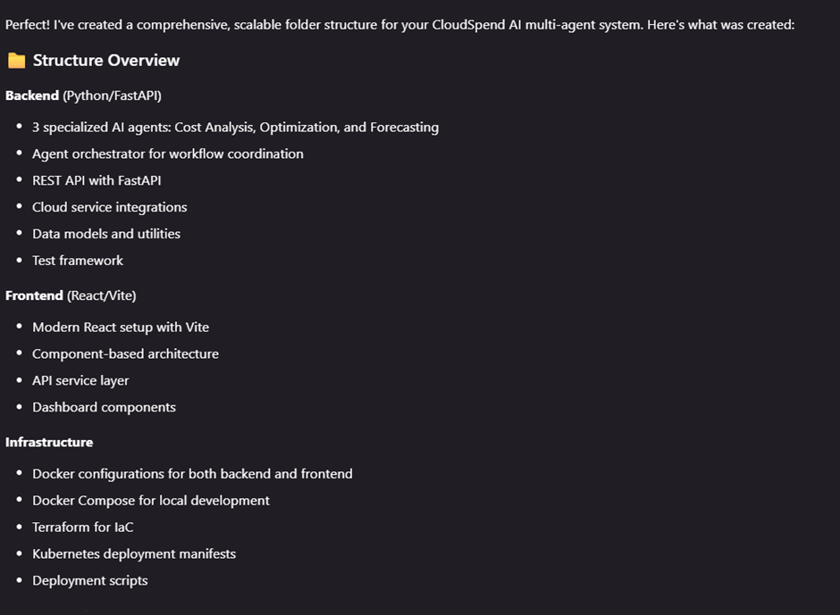
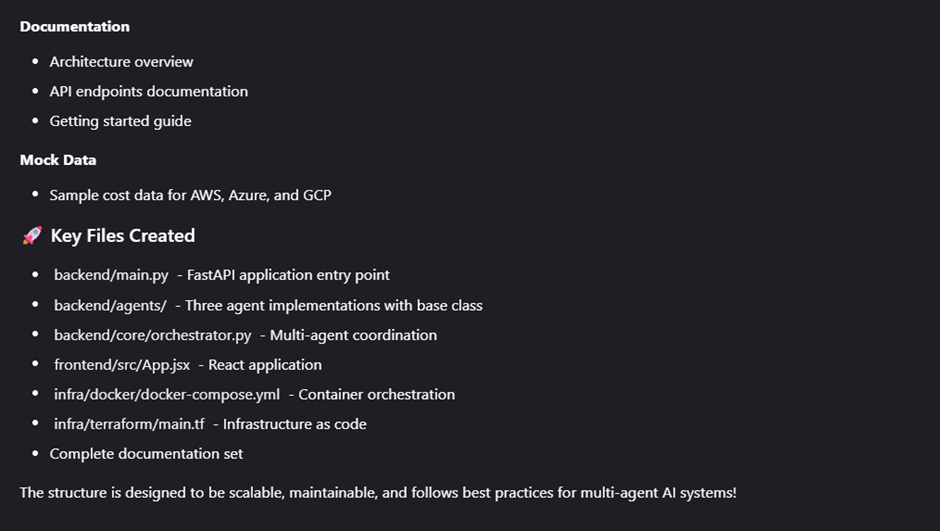
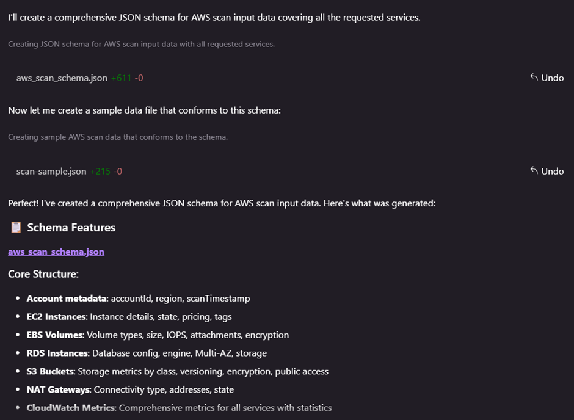
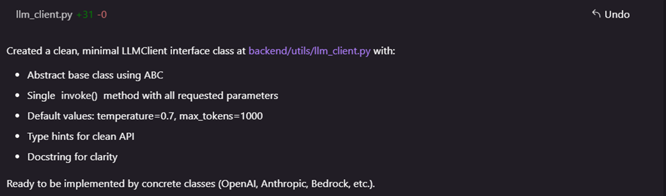
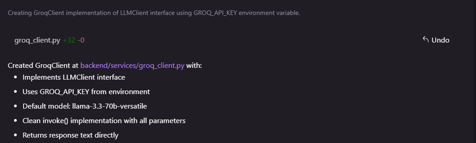
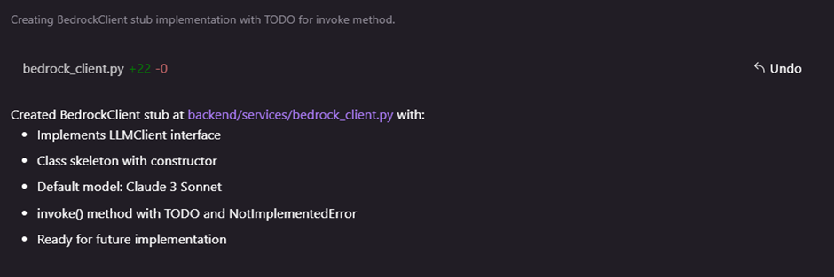
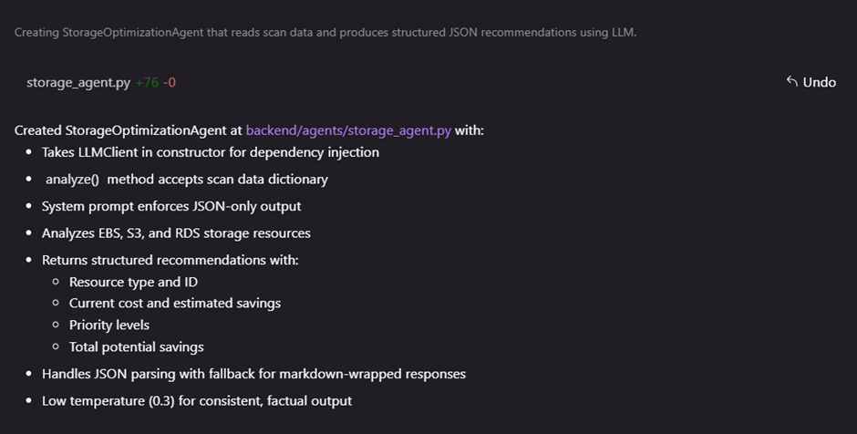
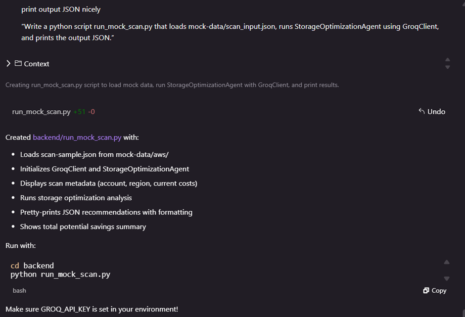
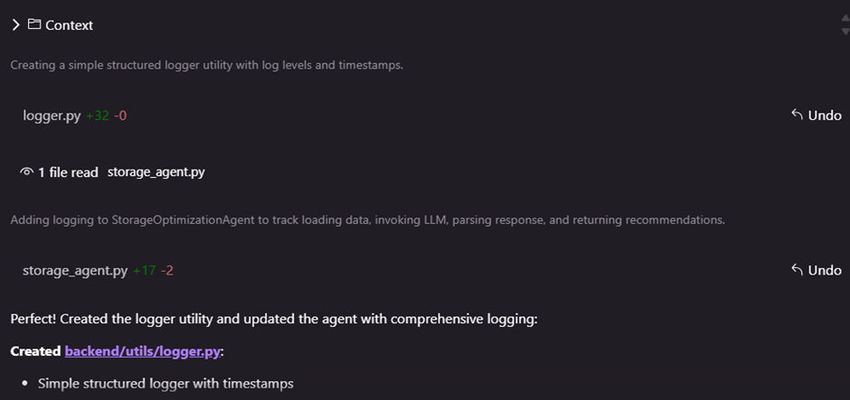
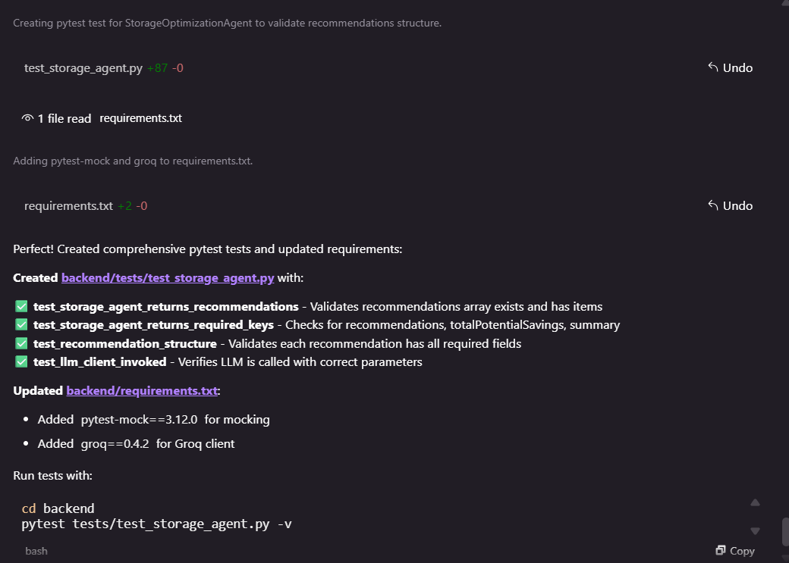

# Repo scaffolding
prompt: “Create a scalable repository folder structure for a multi-agent AI system called CloudSpend AI. Include backend, frontend, infra, docs, mock-data. Create placeholder files.”

# Schema generation
prompt used: “Generate a JSON schema for AWS scan input data including EC2, EBS, RDS, S3, NAT gateways, and CloudWatch metric summaries.”

“Create realistic mock AWS resource inventory data for a cost optimization agent. Include 2 idle EC2 instances, 1 unattached gp2 volume, 1 large snapshot, 1 S3 bucket without lifecycle policy.”

# Agent boilerplate
prompts used:
1. “Write a clean Python interface class LLMClient with invoke(system_prompt, user_prompt, temperature, max_tokens).”
2. “Write GroqClient implementing LLMClient using GROQ_API_KEY env variable.”
3. “Create a BedrockClient implementing the same interface, but leave invoke() unimplemented with a TODO.”
4. “Write a StorageOptimizationAgent that reads scan_input JSON and produces structured recommendations JSON. It should call llm.invoke() and enforce JSON-only output.”
5. “Write a python script run_mock_scan.py that loads mock-data/scan_input.json, runs StorageOptimizationAgent using GroqClient, and prints the output JSON.”
6. “Create a simple structured logger utility for python with log levels and timestamps.”

# Unit tests
prompt used: “Write a pytest test to validate that StorageOptimizationAgent returns recommendations array and required keys.”

